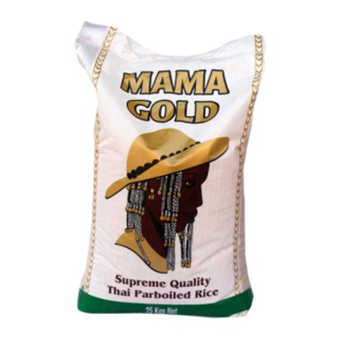

# Responsive online shop with JavaScript

> I have called it Marketize

## Desktop Preview

## Mobile Preview

## Built With

- HTML
- Javascript

## Getting Started

To get a local copy up and running follow these simple example steps.

### Download 
https://github.com/gabrie-lhilarion/marketize.git
 
Follow this link to my GitHub repository. Copy the link from the code button
 
After you have copied the link, enter the command below in your terminal
 
git clone https://github.com/Lucas-Masaba/awesome_books.git

## Remember to paste the link after the git clone command 

## Author

👤 **Gabriel Hilarion**

- GitHub: [@githubhandle](https://github.com/gabrie-lhilarion)
- LinkedIn: [LinkedIn](https://www.linkedin.com/in/gabrielhilarion/)

## Online View

[Here]( https://github.com/gabrie-lhilarion/marketize/dist) is a link to the online view of my website

## Mobile Preview

## Show your support

Give a ⭐️ if you like this project!

